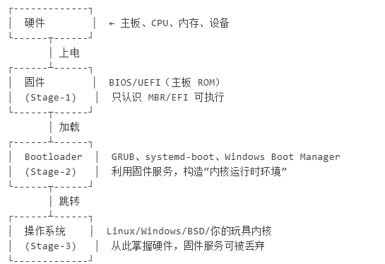

# 一个操作系统内核被拉起的过程

## 硬件上电与初始化
1. cpu上电，始终开始震荡，寄存器全部置为初始值
2. PC被置为Reset Vector，这是一个固定地址，cpy从此处开始执行机器码，不同架构cpu的Reset Vector不同。
3. 但是此时内存还未初始化，RAM中的数据未定义，CPU只能访问ROM，一般是主板上的SPI FLash，在x86架构中就是BIOS。开启下一阶段的固件初始化。

## 固件初始化
1. ROM会初始化最小硬件，关闭中断让CPU处于特权模式，然后设置栈指针，初始化内存（DRAM）控制器，并将下一阶段的Bootloader中加载到DRAM中。、
2. Bootloader是第一个可自定义的代码，比如x86架构的GRUB。Bootloader会进入操作系统内核起点，并拉起操作系统。

## Bootloader阶段
1. 引导程序（Bootloader）会初始化更多硬件，比如串口，网卡，磁盘等。
2. 引导程序会解析内核的镜像格式，比如ELF，zImage，FIT等。然后设置启动参数，比如ATAGS，FDT，EFI内存映射。
3. 跳转到内核入口位置，拉起操作系统内核代码。

## 内核入口
1. 内核的入口是内核的汇编部分。
2. 汇编初始化CPU状态，识别CPU的类型，保存从Bootloader传来的参数，并关闭MMU，缓存与中断。
3. 创建一个临时页表，创建identity mapping，一个从虚拟地址到物理地址的映射。
4. 打开MMU，开始最终的内存设置与控制，包括内存属性，内存映射等。
5. 调用start_kernel，进入C语言部分。开始执行操作系统内核的C代码。

***
# 一些基本概念
## MMU是什么？为什么操作系统内核入口会先关闭再打开？
Memory Management Unit，内存管理单元。CPU内部的一块硬核电路，负责把“虚拟地址”翻译成“物理地址”。
Linux/Windows/macOS 这种“多任务、带进程”的操作系统刚需这个电路。

在打开MMU之前，物理地址完全就是虚拟地址。CPU访问地址与实际地址完全一致。在Boot ROM（BIOS），Bootloader早期以及内核入口部分位置都是这种状态。打开MMU后，CPU访问的地址将会被翻译成不同的物理地址。MMU通过查页表和偏移得到物理地址，完成地址翻译。

在Boot Rom中，物理地址与虚拟地址完全一致映射。在Bootloader中，可能是一致映射，也可能是Bootloader创建的临时内存映射。不管如何，都需要关闭之前的内存映射，重新启动，以适应新的操作系统内核需要的内存映射。

## 什么是Multiboot2？此项目中如何应用？
Multiboot2是一种内核镜像的引导规范，它允许内核在启动时获取有关硬件信息，并决定如何启动。

在镜像的头部中，即内核入口的汇编部分添加一个Multiboot2头部结构，由四个部分组成，分别是一个multiboot2魔数数，一个架构标志（0 = i386, 4 = MIPS32, 8 = ARM64），一个头部长度，一个校验和。添加一个Multiboot2头部结构，并将内核置于32bit保护模式后，GRUB将会认为这是一个有效的Multiboot2镜像，并尝试拉起它。

## 什么叫Grub？它如何与multiboot2结合拉起操作系统？
GNU GRUB（Grand Unified Bootloader）是一个多重启动管理器
能链式加载 Windows、Linux、自己写的OS等任意 Multiboot2/EFI/BIOS 可执行文件。GRUB支持多种平台和架构，是Multiboot2的执行者，只要符合multiboot2规范，就能被GRUB加载。

ROM将GRUB加载到DRAM中，本质上GRUB就是磁盘中一个efi文件（可以在windows系统中找到它），保存在磁盘固定位置。ROM只需要将GRUB的第一行代码搬进RAM中就结束，GRUB会自己把自己加载到RAM中，并执行。

GRUB会识别文件系统、LVM、RAID、LUKS、网络，找到内核和 initrd。按 Multiboot2/ELF/Linux/PE 规范，把内核重定位到内存合适位置。把内存地图、命令行、initrd、帧缓冲、ACPI、RSDP 打包成标准结构交给内核。退出固机服务，把 CPU 控制权完全交给内核，自己退出

但是处于学习目的，本项目并未使用GRUB拉起系统，而是直接使用BIOS引导。此项目也模拟了GRUB自己拉起自己的过程，更加清晰。

***
# 本项目的基本实现
## 三阶段的启动过程
### bootsect阶段
BIOS会加载第一个512字节引导扇区，加载到内存地址：0x7c00。这就是第一个最小执行阶段，它完成以下任务：

1. 引导扇区加载到0x7c00
2. 清理段寄存器，以避免寄存器中的垃圾信息影响后续
3. 显示启动信息：“booting”
4. 加载第二阶段的引导程序（在第二扇区）到内存0x8000，并跳转到第二阶段
5. 固定自己的大小为512字节并在最后添加魔术数，向bios确认自己是一个启动扇区

第一阶段的工作基本是引导第二阶段，让BIOS正确识别并拉起自己，然后可以拉起接下来的第二阶段，以完成完整的bootload过程。
第一阶段是必须存在的，因为BIOS会从0x7c00处开始执行，必须让硬件找到第一个引导扇区。

### stage2阶段
stage2将内核从16位实模式升级到32位保护模式，再升级到64位长模式。

16位实模式是硬件的复位默认模式，是为了让硬件BIOS能正确识别和启动引导扇区，为了找到第一行代码。
32位保护模式是开分页，建立GDT的必经之路，是为了到到64位长模式的过渡。
64位长模式是现代OS的标准模式，执行内核的C代码需要在此模式。

stage2首先在16位模式工作，设置新的堆栈，避免和引导区冲突，并设置GDT，并进入32位保护模式。在32位保护模式下，stage2同样需要设置新的堆栈，然后检查是否能支持长模式，如果支持，将会设置64位GDT并进入64位长模式。

GDT的工作是

需要注意的是，在进入64位长模式之前，首先需要启用PAE，设置一个临时也表，并启用EFER.LME，这些都是进入长模式的必要步骤

### main阶段

此时进入C语言函数，直接写架内核的C代码，完成内核的初始化。

# 默认的内核启动方式

使用GRUB引导boot.asm启动，并加载kernel.bin内核，因为满足multiboot2的要求，GRUB会自动将kernel.bin加载到内存，并调用kernel.bin的入口函数，大大减小开发难度。